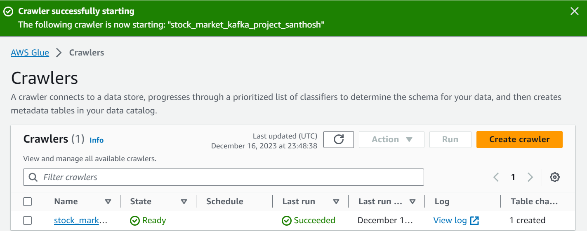

# Stock Market Kafka Real Time Data Engineering Project

## Introduction 
End-To-End Data Engineering Project on Real-Time Stock Market Data using Kafka.

## technologies 
Python, Amazon Web Services (AWS), Apache Kafka, Glue, Athena, and SQL.

## Architecture 

## Technology Used
- Programming Language - Python
- Amazon Web Service (AWS)
1. S3 (Simple Storage Service)
2. Athena
3. Glue Crawler
4. Glue Catalog
5. EC2
6. Apache Kafka

## Execution
1. S3
   
2.  Athena
   
3. Glue
   
4. Crawler
   
   
## Dataset Used
 https://github.com/guntupalli09/stock_market-real_time-analysis/blob/e05f3805ddb4519cb31091e04dcd9efff15eb980/indexProcessed.csv

